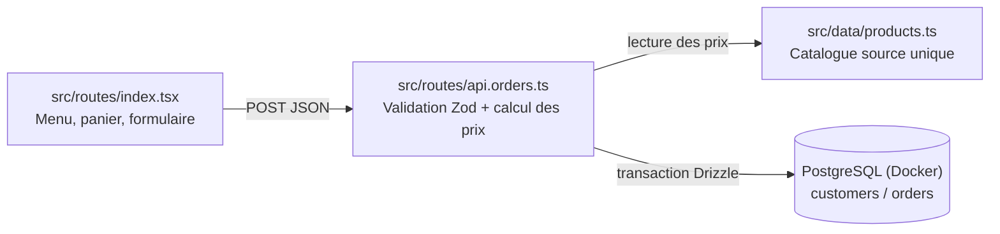

# Makrouna Tounsia

Site de commande en ligne pour une cuisine tunisienne spécialisée dans les pâtes au thon, poulpe, fruits de mer, anguille et bœuf. Les clients composent leur panier, indiquent leurs coordonnées et reçoivent une confirmation après l'enregistrement de leur commande.

Le projet tourne entièrement en conteneurs Docker (application + base de données), sans dépendance à un fournisseur d'hébergement propriétaire.

## Sommaire

- [Technologies](#technologies)
- [Fonctionnalités](#fonctionnalités)
- [Architecture](#architecture)
- [Structure du projet](#structure-du-projet)
- [Développement local](#développement-local)
- [Base de données](#base-de-données)
- [API commandes](#api-commandes)
- [Programme de fidélité](#programme-de-fidélité)
- [Notifications de commande](#notifications-de-commande)
- [Déploiement](#déploiement)
- [Conventions](#conventions)

## Technologies

- React 19, TypeScript et TanStack Start (`@tanstack/react-start`) pour le rendu serveur et les routes fichiers
- TanStack Router pour le routage type-safe côté client
- Tailwind CSS 4 avec une identité visuelle personnalisée
- Vite 7 pour le build, et `srvx` pour servir le build de production (serveur Node natif basé sur les standards Web Fetch)
- Zod pour la validation des données côté serveur
- PostgreSQL 16 et Drizzle ORM (`drizzle-orm/node-postgres`) pour les clients, commandes et points fidélité
- Docker et Docker Compose pour l'exécution locale et la base de données, pnpm comme gestionnaire de paquets

## Fonctionnalités

- Carte complète avec prix en dinars tunisiens
- Panier responsive et formulaire de livraison
- Paiement à la livraison avec confirmation téléphonique
- Fidélité automatique par numéro de téléphone
- Dessert offert à chaque dixième commande
- Enregistrement persistant des commandes

## Architecture

Le parcours d'achat est une page unique qui appelle un endpoint serveur, lequel revalide les prix et persiste la commande.



- **Client** (`src/routes/index.tsx`) : gère l'état du panier, affiche la carte et soumet la commande en JSON à `/api/orders`.
- **Serveur** (`src/routes/api.orders.ts`) : seul endroit qui valide les données, recalcule les prix depuis le catalogue et écrit en base dans une transaction.
- **Base de données** (`db/schema.ts`, `db/index.ts`) : PostgreSQL via Drizzle ORM (`drizzle-orm/node-postgres`), avec les tables `customers` et `orders`.

## Structure du projet

```
src/
  routes/
    __root.tsx       # Layout HTML racine, meta et styles globaux
    index.tsx         # Page boutique: menu, panier, formulaire de commande
    api.orders.ts      # Endpoint serveur POST /api/orders
  data/
    products.ts        # Source unique du catalogue et des prix
  router.tsx           # Configuration du routeur TanStack
  styles.css           # Identité visuelle et responsive design
db/
  schema.ts            # Tables Drizzle `customers` et `orders`
  index.ts             # Client Postgres (drizzle-orm/node-postgres)
netlify/database/migrations/ # Migrations SQL générées par drizzle-kit
public/
  images/                # Visuels de marque
docker-compose.yml       # Service Postgres local
.env.example             # Variables d'environnement (DATABASE_URL, identifiants Postgres)
```

## Développement local

Tout tourne dans Docker, rien n'est installé sur la machine hôte (Docker Engine + Compose mis à part).

```bash
cp .env.example .env
docker compose up -d db
```

Puis, dans un conteneur Node éphémère (exemple avec `node:20-alpine`) :

```bash
corepack enable && corepack prepare pnpm@10 --activate
pnpm install
pnpm approve-builds --all   # autorise les scripts natifs (esbuild, sharp)
pnpm db:migrate             # applique les migrations sur le Postgres Docker
pnpm dev                    # serveur de développement sur http://localhost:3000
```

Pour un build de production local :

```bash
pnpm build
pnpm start   # sert dist/server + dist/client via srvx
```

## Base de données

Le schéma (`db/schema.ts`) définit deux tables Postgres via Drizzle ORM :

- **`customers`** : `id`, `name`, `phone` (unique, sert d'identifiant de fidélité), `orderCount`, `createdAt`, `updatedAt`.
- **`orders`** : `id` (uuid), `customerId`, `customerName`, `phone`, `address`, `city`, `notes`, `items` (jsonb du détail des plats commandés), `subtotal`, `status`, `loyaltyReward`, `createdAt`.

La chaîne de connexion est lue depuis la variable d'environnement `DATABASE_URL` (voir `.env.example`). Les migrations sont générées avec `pnpm exec drizzle-kit generate --name <nom>` et appliquées avec `pnpm db:migrate`.

## API commandes

`POST /api/orders` ([src/routes/api.orders.ts](src/routes/api.orders.ts)) reçoit le panier et les coordonnées du client, puis :

1. Valide le corps de la requête avec un schéma `zod` (nom, téléphone, adresse, ville, notes, honeypot anti-spam, liste d'articles).
2. Recalcule systématiquement les prix à partir de `src/data/products.ts` — le prix envoyé par le navigateur n'est jamais utilisé.
3. Crée ou met à jour le client par numéro de téléphone normalisé et incrémente son compteur de commandes de façon atomique (`onConflictDoUpdate`).
4. Enregistre la commande dans une transaction avec le détail des articles et le sous-total.
5. Retourne l'identifiant de commande, le compteur de fidélité et si un dessert est offert.

## Programme de fidélité

Le numéro de téléphone normalisé identifie chaque client. Toutes les 10 commandes, `loyaltyReward` passe à `true` et un dessert est offert automatiquement, sans carte physique.

## Notifications de commande

La notification du restaurateur à chaque nouvelle commande reste à mettre en place (l'intégration précédente reposait sur Netlify Forms, retirée avec la migration vers une infrastructure auto-hébergée).

## Déploiement

Le site est conçu pour tourner dans des conteneurs Docker sur un serveur que vous contrôlez (VPS, etc.) :

- `docker-compose.yml` fournit le service PostgreSQL avec un volume persistant.
- `pnpm build` puis `pnpm start` (ou l'équivalent dans un `Dockerfile` applicatif) démarrent le serveur Node natif basé sur `srvx`.
- Les migrations (`pnpm db:migrate`) doivent être appliquées avant le démarrage de l'application en production.

## Conventions

- TypeScript strict et noms explicites.
- Les prix restent définis côté serveur dans `src/data/products.ts` ; aucun prix envoyé par le navigateur n'est accepté.
- Montants stockés en dinars entiers tant que le catalogue ne contient pas de millimes.
- Le numéro de téléphone normalisé sert d'identifiant de fidélité.
- Textes clients en français, avec des touches tunisiennes pertinentes.
- Composants React en PascalCase, fonctions en camelCase.

Voir [AGENTS.md](AGENTS.md) pour le détail des décisions et conventions destinées aux agents de code.
