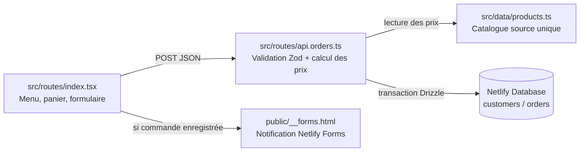

# Makrouna Tounsia

Site de commande en ligne pour une cuisine tunisienne spécialisée dans les pâtes au thon, poulpe, fruits de mer, anguille et bœuf. Les clients composent leur panier, indiquent leurs coordonnées et reçoivent une confirmation après l'enregistrement de leur commande.

## Sommaire

- [Technologies](#technologies)
- [Fonctionnalités](#fonctionnalités)
- [Architecture](#architecture)
- [Structure du projet](#structure-du-projet)
- [Développement local](#développement-local)
- [Base de données](#base-de-données)
- [API commandes](#api-commandes)
- [Programme de fidélité](#programme-de-fidélité)
- [Notifications de commande](#notifications-de-commande)
- [Déploiement](#déploiement)
- [Conventions](#conventions)

## Technologies

- TanStack Start, React 19 et TypeScript
- Tailwind CSS avec une identité visuelle personnalisée
- Netlify Database (Postgres) et Drizzle ORM pour les clients, commandes et points fidélité
- Zod pour la validation des données côté serveur
- Netlify Forms pour transmettre les nouvelles commandes aux notifications du projet
- Netlify pour le déploiement et l'exécution serveur

## Fonctionnalités

- Carte complète avec prix en dinars tunisiens
- Panier responsive et formulaire de livraison
- Paiement à la livraison avec confirmation téléphonique
- Fidélité automatique par numéro de téléphone
- Dessert offert à chaque dixième commande
- Enregistrement persistant des commandes
- Notification Netlify Forms contenant le détail de chaque commande

## Architecture

Le parcours d'achat est une page unique qui appelle un endpoint serveur, lequel revalide les prix et persiste la commande avant de déclencher la notification.



- **Client** (`src/routes/index.tsx`) : gère l'état du panier, affiche la carte et soumet la commande en JSON à `/api/orders`.
- **Serveur** (`src/routes/api.orders.ts`) : seul endroit qui valide les données, recalcule les prix depuis le catalogue et écrit en base dans une transaction.
- **Base de données** (`db/schema.ts`, `db/index.ts`) : Netlify Database (Postgres) via Drizzle ORM, avec les tables `customers` et `orders`.
- **Notifications** : une fois la commande enregistrée, le client envoie une soumission au formulaire statique `public/__forms.html` pour déclencher les emails Netlify Forms, sans jamais faire dépendre l'enregistrement de la commande de cette étape.

## Structure du projet

```
src/
  routes/
    __root.tsx       # Layout HTML racine, meta et styles globaux
    index.tsx         # Page boutique: menu, panier, formulaire de commande
    api.orders.ts      # Endpoint serveur POST /api/orders
  data/
    products.ts        # Source unique du catalogue et des prix
  router.tsx           # Configuration du routeur TanStack
  styles.css           # Identité visuelle et responsive design
db/
  schema.ts            # Tables Drizzle `customers` et `orders`
  index.ts             # Client Netlify Database
netlify/
  database/migrations/ # Migrations SQL générées par drizzle-kit
public/
  __forms.html          # Squelette statique requis pour la détection Netlify Forms
  images/                # Visuels de marque
```

## Développement local

```bash
pnpm install
pnpm dev
```

Le site est disponible sur le port indiqué par Vite (3000 par défaut). Pour émuler les services Netlify localement, utiliser `netlify dev --port 8889`.

Autres commandes utiles :

```bash
pnpm build                                    # Compilation de production
pnpm exec drizzle-kit generate --name <nom>   # Génère une migration après modification du schéma
```

## Base de données

Le schéma (`db/schema.ts`) définit deux tables Postgres via Drizzle ORM :

- **`customers`** : `id`, `name`, `phone` (unique, sert d'identifiant de fidélité), `orderCount`, `createdAt`, `updatedAt`.
- **`orders`** : `id` (uuid), `customerId`, `customerName`, `phone`, `address`, `city`, `notes`, `items` (jsonb du détail des plats commandés), `subtotal`, `status`, `loyaltyReward`, `createdAt`.

Les migrations sont générées avec `drizzle-kit` et stockées dans `netlify/database/migrations/`, où elles sont appliquées automatiquement au déploiement.

## API commandes

`POST /api/orders` ([src/routes/api.orders.ts](src/routes/api.orders.ts)) reçoit le panier et les coordonnées du client, puis :

1. Valide le corps de la requête avec un schéma `zod` (nom, téléphone, adresse, ville, notes, honeypot anti-spam, liste d'articles).
2. Recalcule systématiquement les prix à partir de `src/data/products.ts` — le prix envoyé par le navigateur n'est jamais utilisé.
3. Crée ou met à jour le client par numéro de téléphone normalisé et incrémente son compteur de commandes de façon atomique (`onConflictDoUpdate`).
4. Enregistre la commande dans une transaction avec le détail des articles et le sous-total.
5. Retourne l'identifiant de commande, le compteur de fidélité et si un dessert est offert.

## Programme de fidélité

Le numéro de téléphone normalisé identifie chaque client. Toutes les 10 commandes, `loyaltyReward` passe à `true` et un dessert est offert automatiquement, sans carte physique.

## Notifications de commande

Après l'enregistrement réussi en base, le client envoie une soumission au formulaire Netlify `nouvelle-commande` (déclaré dans `public/__forms.html`) contenant le récapitulatif de la commande. Une panne de cette notification ne supprime jamais une commande déjà enregistrée.

Dans Netlify, ajouter l'adresse du restaurateur dans **Project configuration → Notifications → Emails and webhooks → Form submission notifications** afin de recevoir un email à chaque commande.

## Déploiement

Le site est déployé sur Netlify (`netlify.toml`) : `vite build` publie `dist/client`, les fonctions serveur de TanStack Start s'exécutent via le plugin Netlify, et les migrations de base de données sont appliquées automatiquement.

## Conventions

- TypeScript strict et noms explicites.
- Les prix restent définis côté serveur dans `src/data/products.ts` ; aucun prix envoyé par le navigateur n'est accepté.
- Montants stockés en dinars entiers tant que le catalogue ne contient pas de millimes.
- Le numéro de téléphone normalisé sert d'identifiant de fidélité.
- Textes clients en français, avec des touches tunisiennes pertinentes.
- Composants React en PascalCase, fonctions en camelCase.

Voir [AGENTS.md](AGENTS.md) pour le détail des décisions et conventions destinées aux agents de code.
